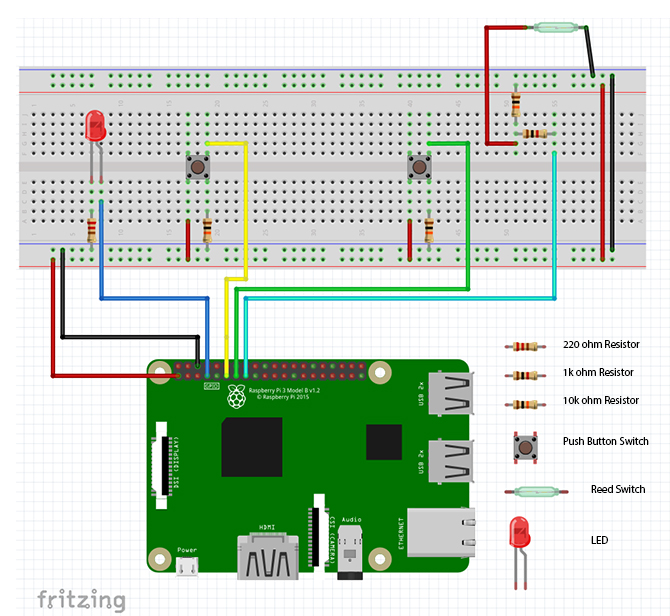

# SmartDoorMusic

The Smart Door Music demonstrates how to create a “smart” doormusic. In this project we’ll use a Raspberry Pi, a few simple components and a reed switch to trigger a theme tune when a door is opened.

## ScreenShots


## Schematics



## You will need 

A Raspberry Pi (any model will work for this).
- 1 x 220 Ohm resistor
- 1 x 1K Ohm resistor
- 3 x 10K Ohm resistor
- 1 x Magnetic reed switch
- 1 x LED
- 2 x Push-button switch
- Breadboard
- Hook-up cables
- Computer speaker or similar

## Enable auto-launch behavior

This sample app is currently configured to launch only when the script is run from your development machine. To enable the main activity to launch automatically on boot, add the following line in the rg.local (open with sudo in order to change it): 

```python /(location)/music.py```
